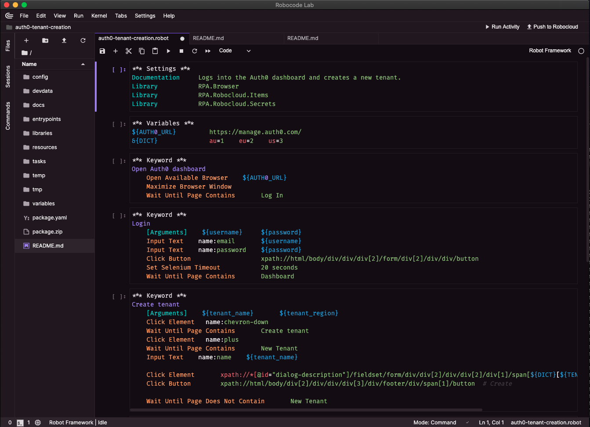
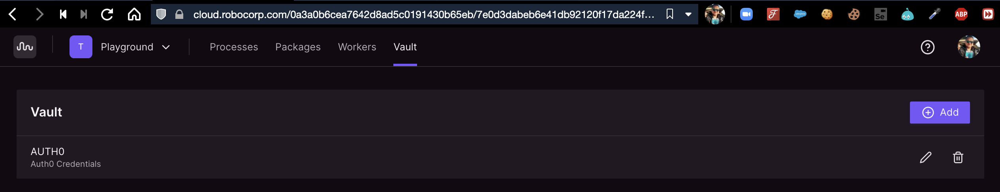
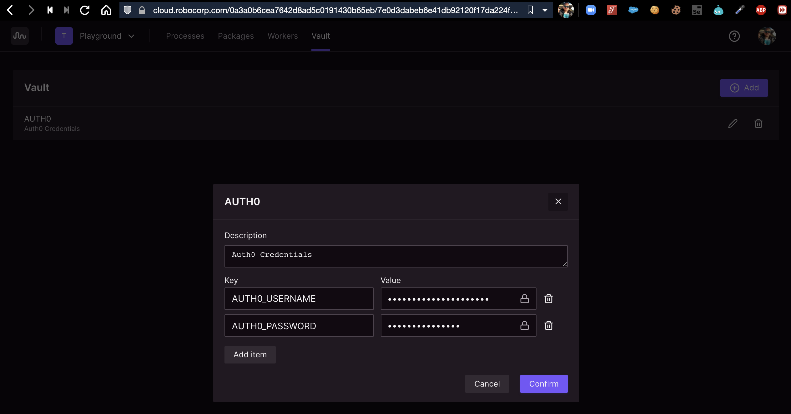
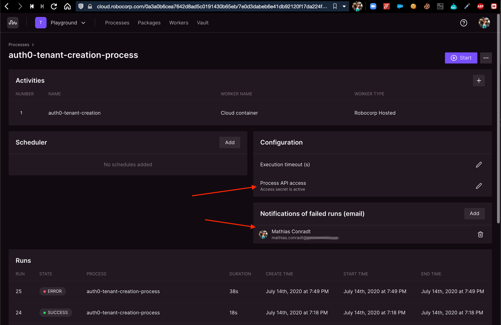
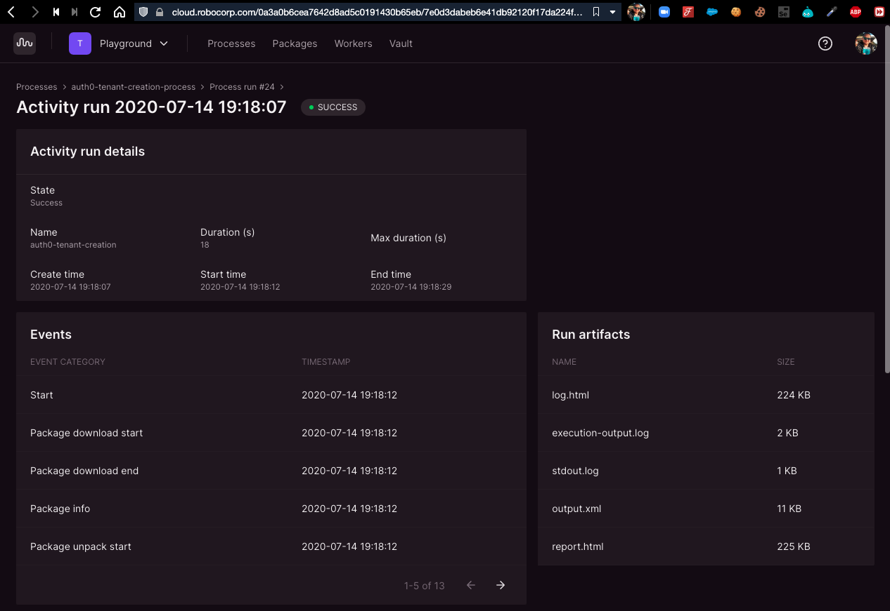

# Auth0 Tenant Creation via RPA (Robotic Process Automation)

Robotic Process Automation (RPA) is commonly used to automate repetitive tasks where there are no public APIs available.

When looking into Robocorp / Robocloud and learning the platform, I was looking for a useful use case, so I picked a use case that was asked about in the Auth0 community a few times:

How to create an Auth0 tenant programmatically?

* https://community.auth0.com/t/sales-question-about-tenants/18498
* https://community.auth0.com/t/support-for-hundreds-of-tenants/21667/2
* https://community.auth0.com/t/management-api-to-create-a-tenant-and-to-install-and-configure-an-extension/40537
* https://community.auth0.com/t/tenant-management-for-saas/12600


There is no public API available for this, so using RPA here might be a suitable workaround. 

Note that this approach is not an official Auth0 advice nor officially supported, however, imo it's better than nothing. Surely, in case the Auth0 Dashboard UI changes, the automation process might break and needs adjustment, but so does a manual approach, and you'd get informed via email about failed process runs.

So, see this more of a PoC, also it would probably make sense to add another robot that invites another admin to the tenant. This is not yet part of this example.

**Why would you want to create so many Auth0 tenants in the first place?**

There are B2B SaaS scenarios where the recommended approach, handling multiple logical business tenants within one technical Auth0 tenant, as documented in this blog post https://auth0.com/blog/using-auth0-for-b2b-multi-and-single-tenant-saas-solutions/ or https://auth0.com/docs/design/using-auth0-with-multi-tenant-apps isn't suitable.
That said, you should double check above resources whether you really need to create a separate Auth0 tenant for ever logical business tenant.


[](https://youtu.be/7rWuvSq-M7k)

## Robocorp

If you want to clearn about Robocorp, Robocloud and Robot/RPA Framework, please see 
* https://robocorp.com/
* https://rpaframework.org
* https://robotframework.org

RPA Framework is a collection of open-source libraries and tools for Robotic Process Automation (RPA), and it is designed to be used with both Robot Framework and Python. The goal is to offer well-documented and actively maintained core libraries for Software Robot Developers.


## Setup

### The Robot

First, create a robot project with the following robot (entire project is available in this repository), which logs into the Auth0 Dashboard, clicks on the Avatar > Create Tenant menu option and creates a new tenant based on provided tenant name and region.




```
*** Settings ***
Documentation     Logs into the Auth0 dashboard and creates a new tenant.
Library           RPA.Browser
Library           RPA.Robocloud.Items
Library           RPA.Robocloud.Secrets

*** Variables ***
${AUTH0_URL}         https://manage.auth0.com/
&{DICT}              au=1    eu=2    us=3

*** Keyword ***
Open Auth0 dashboard
    Open Available Browser    ${AUTH0_URL}
    Maximize Browser Window
    Wait Until Page Contains       Log In

*** Keyword ***
Login
    [Arguments]    ${username}     ${password}
    Input Text    name:email       ${username}
    Input Text    name:password    ${password}
    Click Button                   xpath://html/body/div/div/div[2]/form/div[2]/div/div/button
    Set Selenium Timeout           20 seconds
    Wait Until Page Contains       Dashboard

*** Keyword ***
Create tenant
    [Arguments]    ${tenant_name}       ${tenant_region}
    Click Element   name:chevron-down
    Wait Until Page Contains       Create tenant    
    Click Element   name:plus
    Wait Until Page Contains       New Tenant
    Input Text    name:name    ${tenant_name}

    Click Element       xpath://*[@id="dialog-description"]/fieldset/form/div/div[2]/div/div[2]/div[1]/span[${DICT}[${TENANT_REGION}]]/button  # Flag    
    Click Button        xpath://html/body/div[2]/div/div/div[3]/div/footer/div/span[1]/button  # Create
    
    Wait Until Page Does Not Contain       New Tenant

*** Keyword ***
Init Environment for API
    Load Work Item From Environment
    ${T_NAME}=    Get Work Item Variable    TENANT_NAME
    ${T_REGION}=    Get Work Item Variable    TENANT_REGION    
    Set Global Variable    ${TENANT_NAME}       ${T_NAME}        
    Set Global Variable    ${TENANT_REGION}     ${T_REGION}     

*** Keyword ***
Init Environment for Local Dev    
    Set Global Variable    ${TENANT_NAME}       %{TENANT_NAME}        
    Set Global Variable    ${TENANT_REGION}     %{TENANT_REGION}    

*** Tasks ***
Log into the Auth0 dashboard and create a new tenant
    Open Auth0 dashboard
    ${secrets}=   Get Secret  AUTH0        
    Login              ${secrets}[AUTH0_USERNAME]       ${secrets}[AUTH0_PASSWORD]
    
    Run Keyword And Ignore Error       Init Environment for API
    Run Keyword And Ignore Error       Init Environment for Local Dev    
    
    Create tenant      ${TENANT_NAME}           ${TENANT_REGION}
    [Teardown]    Close Browser
```

### Configuring the process

As for the credentials, they are securly stored in the Robocloud Vault and use a username with a long and strong password, which is only used for this RPA. Obviously MFA is not really possible with RPA.





As for the process, I enabled Process API access in order to be able to trigger the process via REST API call / Curl.

I also set an email address for notifications in case of failed runs.




### Triggering the process via API

The robot can be triggered via API call, here I use `curl`, and tenant name as well as region can be passed along as parameters in the body.

The robot runs unattended and headless.

```bash
curl --request POST --header "robocloud-process-secret: [PROCESS_API_SECRET]" --header "Content-Type: application/json" --data "{\"variables\":{\"TENANT_NAME\":\"[YOUR_TENANT_NAME]\",\"TENANT_REGION\":\"[us|eu|au]\"}}" https://api.eu1.robocloud.eu/workspace-v1/workspaces/[YOUR_WORKSPACE_ID]/processes/[YOUR_PROCESS_ID]/runs
```

### Logs and Report

You can drill into a process run to see the console output / logs and also can get a full html report. In case of errors, a screenshot is taken and available inside the report as well.




## Feedback & Questions

For feedback or questions, message me via Twitter at https://twitter.com/mathiasconradt
